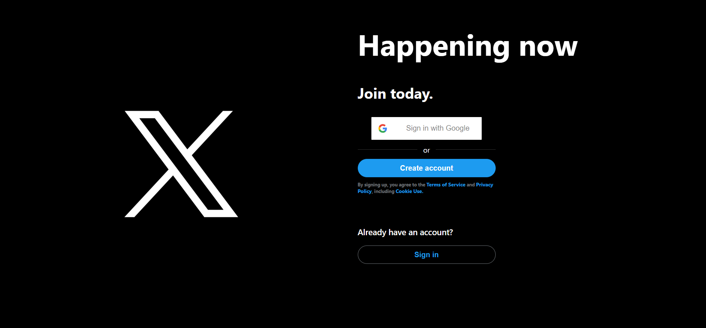
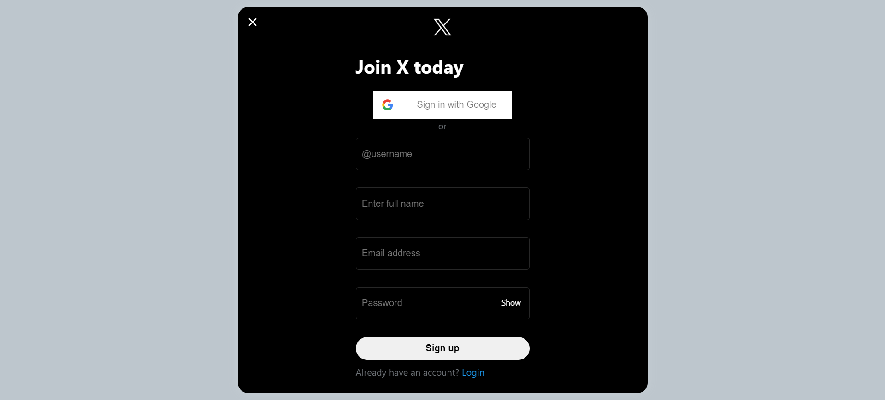
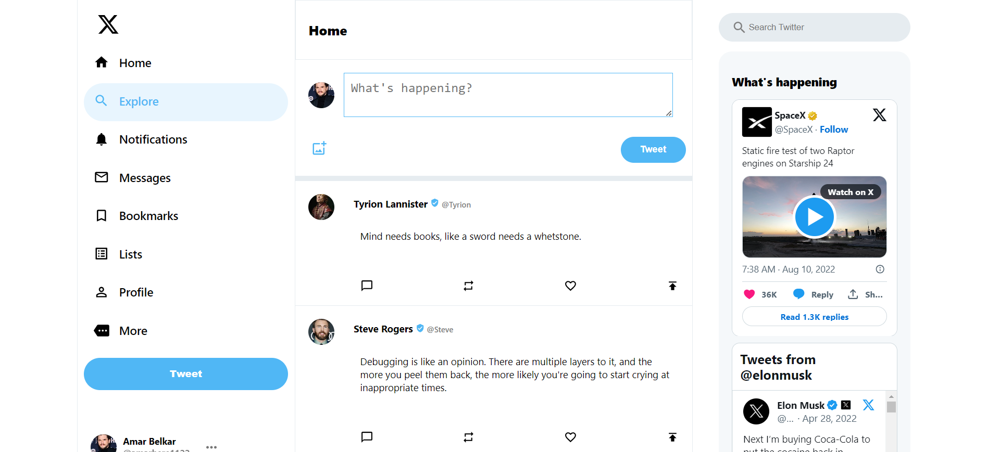
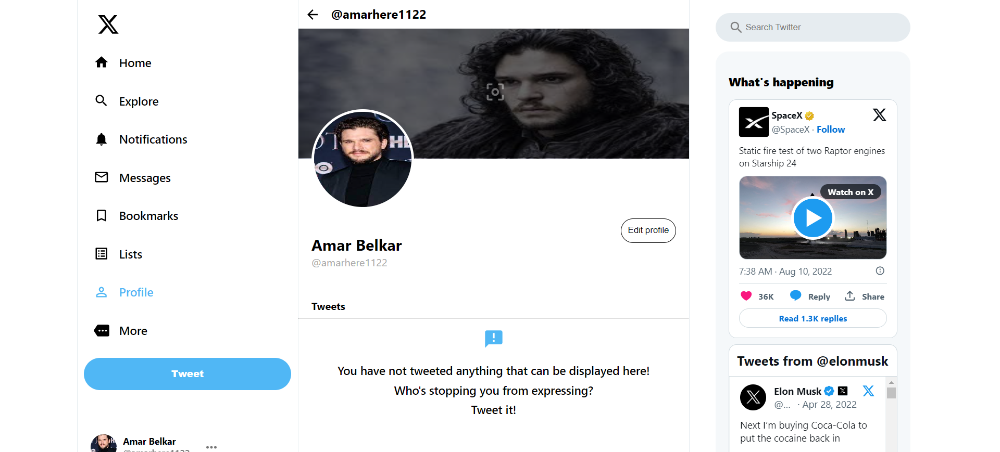
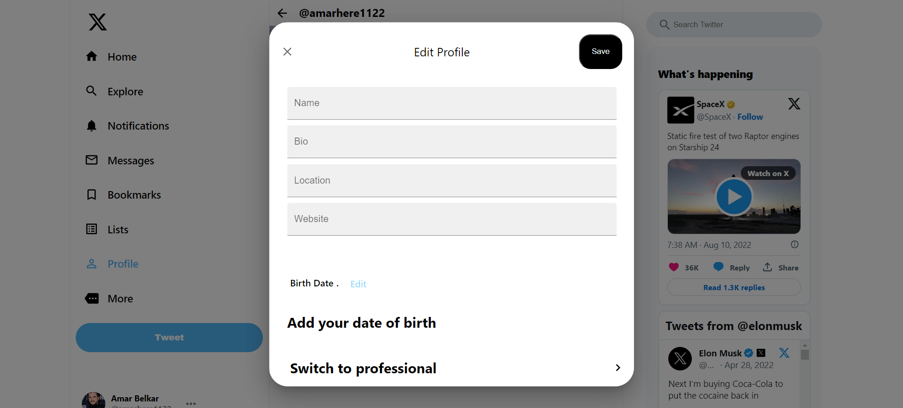
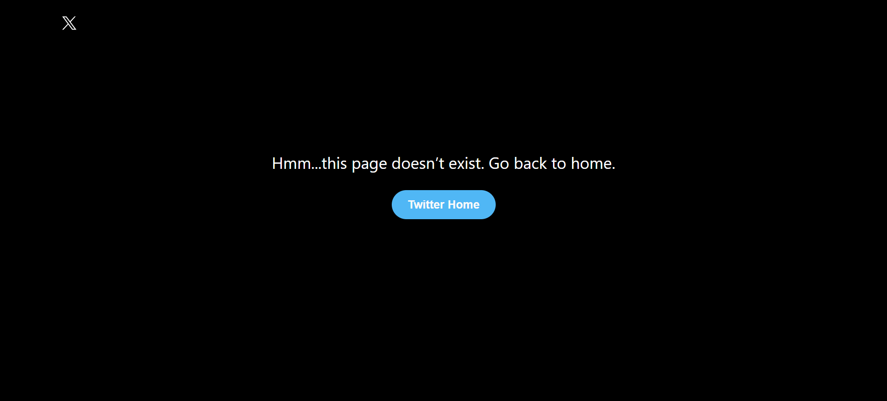

<div align="center">
  <a href="https://github.com/Amar7021/MERN-Twitter-Clone">
    
  </a>
<h3 align="center">TWITTER Clone</h3>
  <p align="center">
    A FULLSTACK MERN TWITTER CLONE 2023
    <br />
    <br />
    <a href="https://mern-twitter-clone-theta.vercel.app">View website</a>
    <br />
    <br />
  </p>
</div>

## Resources

- [MongoDB](https://www.mongodb.com)
- [Express](https://expressjs.com)
- [React.js](https://react.dev)
- [Node.js](https://nodejs.org)
- [Material UI](https://mui.com)
- [Axios](https://axios-http.com)

## Key Features

1. Google Authentication

- Users can log in securely using their Google accounts, providing a seamless and trustworthy authentication process.

2. Tweet Posting

- The platform allows users to compose and share tweets, fostering real-time communication and expression of thoughts.

3. Profile Editing

- Users have the ability to customize their profiles, including details such as name, bio, and other relevant information.

4. Cover Image Customization

- Personalization is key, and users can set unique cover images to reflect their individuality on their profile pages.

## Preview

  
  
  
  
  


## Getting Started

To get a local copy up and running follow these simple steps.

### Installation

- Clone the repository

```
git clone https://github.com/Amar7021/MERN-Twitter-Clone.git
```

- Install NPM packages

```
cd server
npm install  // to install API dependencies
cd ..
cd client
npm install  // to install client dependencies
```

- Run server and front end

```
cd ..
cd server
nodemon start  // to start server
cd ..
cd client
npm start  // to start client side
```

## How to use

- [Sign up](https://mern-twitter-clone-theta.vercel.app/auth/signup) at first user needs to signup using email, username, fullname and password or directly using google login.
- [Login](https://mern-twitter-clone-theta.vercel.app/auth/login) user needs to login with the credentials used for signup i.e email and password or simply through google login.
- Once user is authenticated he can post tweets, edit his profile like bio, name, and other relevant information along with personalization such as editing his profile and cover images.

## Connect with me

[LinkedIn](https://www.linkedin.com/in/amar-belkar-7806101b2/)  
[Gmail](mailto:amarhere1122@gmail.com)
